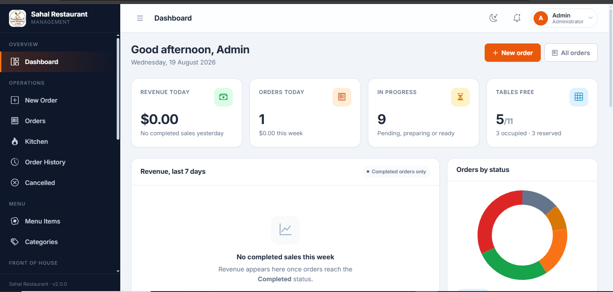
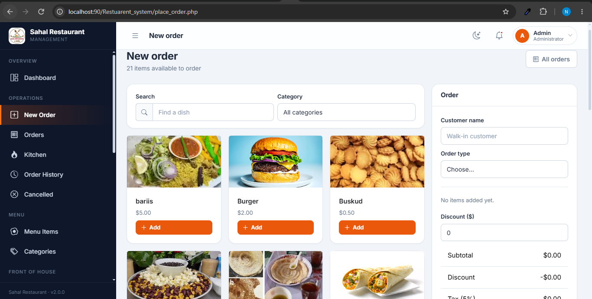
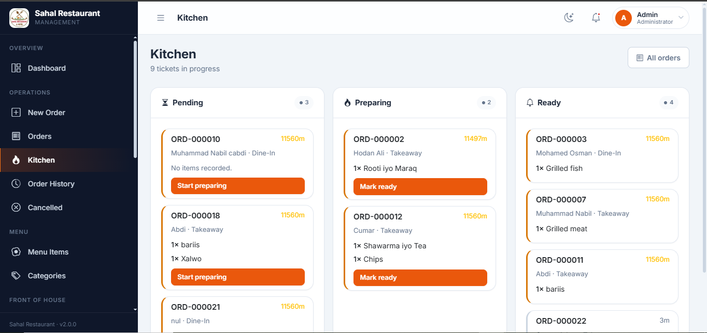
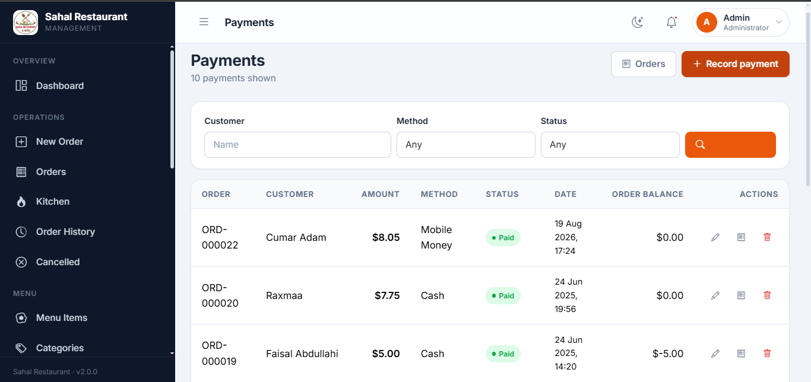

# Sahal Restaurant — Management System

[](https://github.com/Mahboub-jr/sahal-restaurant-system/actions/workflows/ci.yml)
[](LICENSE)


**What it does, in plain terms:** a waiter takes an order on a tablet or
till, the kitchen sees it appear on a live screen and works through it,
the till takes payment and prints a receipt, and a manager can see the
day's sales, who's booked a table tonight, and what's low in the
storeroom — all from one system, with each staff member only able to see
and do what their role allows.

**For developers:** a full-stack PHP 8 / MariaDB restaurant management
system — orders, a live kitchen display, payments with a duplicate-payment
guard, table reservations, inventory with an append-only stock ledger,
staff/attendance, and role-based access control for five staff roles,
built on a single PDO connection with no framework.

This started as an inherited, insecure PHP admin template (see `AUDIT.md`)
and was rebuilt in a series of documented, migration-by-migration passes —
this file's "Current state" section and the `sql/migrations/` folder are
the full paper trail of what changed and why.

**Jump to:** [Features](#features) ·
[Screenshots](#screenshots) ·
[Quick start](#quick-start) ·
[Running it](#running-it) ·
[What to check first](#what-to-check-first) ·
[Architecture](#architecture) ·
[Testing](#testing) ·
[Current state](#current-state) ·
[Known limitations](#known-limitations) ·
[Before going live](#before-going-live)

## Features

- **Orders** — cart-based ordering with server-side pricing (a client can
  never set its own total), real per-item quantities, tax/service charge
  computed from Settings, and Dine-In orders that occupy/free their table
  automatically.
- **Kitchen display** — a live Pending → Preparing → Ready board with a
  one-click "86 this item" that pulls a dish off the menu the moment it
  runs out.
- **Payments & invoicing** — recording a payment locks the order row and
  rejects anything that would overpay it, inside the same transaction —
  the actual fix for the duplicate-payment bug the audit found.
- **Reservations** — party size, notes, a real status lifecycle, and a
  table's live status (Available / Reserved / Occupied) shared with Orders.
- **Inventory** — stock items with a reorder level, backed by an
  append-only movement ledger (received/used/wasted/corrected) — a mistake
  is corrected with a new row, never an edited one.
- **Staff & RBAC** — five roles (admin/manager/cashier/waiter/chef)
  enforced server-side on every page and every write, not just hidden in
  the UI; attendance tracking; CSV exports.
- **Security throughout** — CSRF tokens on every form, bound parameters
  everywhere, secure image uploads (content-verified, not extension-
  trusted), session hardening, POST-only mutations.

## Screenshots

<!--
  Each row below is a placeholder — drop the named file into
  docs/screenshots/ and the image appears automatically; nothing else in
  this file needs to change. See the PR/commit that added this section
  for the exact page + role to screenshot for each one.
-->

| | |
|---|---|
| **Dashboard** — KPIs, revenue trend, low stock, today's reservations |  |
| **New order** — menu grid, cart, live tax/service estimate |  |
| **Kitchen display** — Pending/Preparing/Ready board |  |
| **Invoice** — items, totals, every payment against the order |  |

Missing a screenshot? The image just won't render — nothing else breaks.
See `docs/screenshots/README.md` for exactly what to capture.

## Tech stack

PHP 8 (no framework — deliberately: a single PDO connection, small
per-page scripts, and `actions/*.php` write handlers), MariaDB, Bootstrap 5,
vanilla JS. PHPUnit for the test suite, GitHub Actions for CI.

---

## Quick start

```bash
# The folder name here matches what the rest of this README assumes
# (BASE_URL is computed automatically either way — any folder name works,
# this just keeps the docs below consistent with what you actually have).
git clone https://github.com/Mahboub-jr/sahal-restaurant-system.git Restuarent_system
cd Restuarent_system
composer install          # only needed to run the test suite
```

Then follow **"Running it"** below to get the database and app running
under XAMPP. See **"Testing"** further down to run the test suite.

---

## Running it

### 1. Start XAMPP

Open the XAMPP Control Panel and start **Apache** and **MySQL**.

The project must live inside `htdocs`. It currently does:

```
D:\Xampp\htdocs\Restuarent_system
```

The folder name itself doesn't matter — `config/config.php` computes
`BASE_URL` from wherever the project actually sits — this just keeps every
path this README shows you consistent with a real working copy.

### 2. Create the database

If `restaurant_db` does not exist yet:

1. Open <http://localhost/phpmyadmin>
2. **New** → name it `restaurant_db` → **Create**
3. Select it → **Import** → choose
   `sql/restaurant_db_baseline_2026-08-11.sql` → **Go**

If the database already exists, skip this — but **export a backup first**
(phpMyAdmin → `restaurant_db` → Export → Go) before running any migration.

### 3. Run the migrations

In phpMyAdmin, select `restaurant_db` → **SQL** tab → paste each file and run
them **in order**:

| File | What it does |
|---|---|
| `sql/migrations/001_fix_order_type_enum.sql` | Repairs `order_type`, which was silently discarding dine-in/takeaway |
| `sql/migrations/002_fix_orphan_menu_category.sql` | Reassigns an orphaned menu item and adds a foreign key |
| `sql/migrations/004_menu_items_availability.sql` | Adds the availability switch |
| `sql/migrations/005_order_items_and_totals.sql` | Adds `order_items` (real quantities), tax/service charge, table + waiter on orders |
| `sql/migrations/006_payments_guard.sql` | Tightens `payments` (amount/date/method required, amount must be positive) |
| `sql/migrations/007_reservations_and_inventory.sql` | Adds `reservations` (replaces `table_bookings`), `inventory_items`, `stock_movements` |
| `sql/migrations/008_menu_item_ingredients.sql` | Adds `menu_item_ingredients` — links a menu item's recipe to inventory, so placing an order consumes stock |

Each file has verification queries at the bottom and a rollback block.

> **Before running 002**, open it and check `@new_category_id`. It assigns the
> orphaned item `bariis` to category 11 (Lunch) — change it if rice belongs
> somewhere else on your menu.

> **Before running 005**, read the "JUDGEMENT CALLS" block near the top of
> the file. It backfills 23 historical order line items from three different
> data formats found in the old `orders.items` blob, and a handful of those
> calls (what counts as a name match, what happens to plain-text rows) were
> made without a clear answer in the data — review them before you run it.

> **006 does not fix order 19's known double payment** (BUG-5) — it only
> stops new bad payments going forward. The existing duplicate is left as
> data for you to review; it will show clearly on `invoice.php?id=19`.

> **Before running 007**, note it renames `table_bookings` to
> `table_bookings_legacy` and moves its 3 rows into the new `reservations`
> table. `table_bookings` had no `party_size` column, so those 3 rows get
> a blank party size — read the "JUDGEMENT CALLS" block for the rest.

> **008 starts empty.** There is no existing recipe data anywhere to
> backfill — every ingredient list is entered by hand from `menu.php`
> after this runs. Requires 007 first.

### 4. Open the app

<http://localhost/Restuarent_system/>

You will be sent to the sign-in page. Use an existing account from the `users`
table.

> If you do not know any password, open `create-admin.php` **once** — it now asks you to set
> your own email and password (and refuses to run if an admin already exists).
> Alternatively run `sql/migrations/003_reset_admin_password.sql`. Delete `create-admin.php` afterwards.

---

## What to check first

The foundation and these pages have been rebuilt. Load each and confirm it
behaves:

| Page | What to look for |
|---|---|
| `login.php` | New split-screen sign-in. Wrong password shows an error; 5 wrong attempts locks for a minute |
| `index.php` | Dashboard: KPI cards, 7-day revenue chart, status doughnut, recent orders |
| `menu.php` | Add, edit, delete, availability toggle, search, filter, sort, pagination |

**After running migration 005**, also check:

| Page | What to look for |
|---|---|
| `place_order.php` | Search/filter the menu grid, add items to the cart, change quantities with +/-. Choosing **Dine-In** reveals a table picker; occupied tables are disabled. The estimate at the bottom should track tax and service charge from Settings. Submit and you should land on a receipt. |
| `orders.php` | New order appears as **Pending**. Status buttons only show the moves that are actually allowed (Pending → Preparing → Ready → Completed, or Cancel). Completing/cancelling a Dine-In order should free its table back to Available — check `tables.php`. |
| `update_order.php` | Open **Edit** on a Pending/Preparing/Ready order. Existing items pre-load into the cart; legacy lines that predate migration 005 are called out separately since they cannot be edited through the cart. |
| `receipt.php` | Shows subtotal, discount, tax, service charge, total, table, waiter and payment status. Print button works. |
| `order_history.php` / `cancelled_orders.php` | Completed and Cancelled orders show up here, not on `orders.php`. |
| `index.php` best sellers | Card should no longer say "Approximate" — quantities are now real. |
| `kitchen.php` | Three columns: Pending, Preparing, Ready. "Start preparing" / "Mark ready" buttons move a ticket to the next column and disappear once it reaches Ready — completing is still done from `orders.php`, not here. A ticket sitting 10+ minutes in one stage gets a warning-coloured border. The page auto-refreshes every 25 seconds. Each line item has an 86 button (⊘ icon) that marks that menu item unavailable immediately, so it stops appearing on new orders — click it, then check the same item shows "Off menu" instead of the button, and that it also shows unavailable on `menu.php`. |

**After running migration 006**, also check:

| Page | What to look for |
|---|---|
| `payments.php` | "Record payment" pre-fills today's date. Pick an order, note the balance shown updates as you change the order dropdown. Record a payment equal to the full balance — the order's `payment_status` on `orders.php` should flip to Paid. |
| Duplicate-payment guard | On an order already fully paid, try recording another **Paid** payment — it should be rejected with the balance shown in the error, not silently accepted. Try a **Pending** payment on the same order — that should go through, since Pending doesn't count toward the balance. |
| `invoice.php?id=<order id>` | Shows line items, subtotal/discount/tax/service/total, then every payment recorded, paid total and balance due. Reachable from `orders.php` (cash icon), `payments.php` (receipt icon), and `receipt.php` ("Invoice" button). |
| `invoice.php?id=19` | Order 19's known duplicate payment (BUG-5) — should show **paid more than the total**, flagged with a warning banner, not hidden or auto-corrected. |

**After running migration 007**, also check:

| Page | What to look for |
|---|---|
| `reservations.php` | The 3 migrated bookings show up (2 Seated, 1 Confirmed), with a blank party size. New reservation: assigning a table should flip that table to **Reserved** on `tables.php`; moving the reservation to **Seated** should flip it to **Occupied**; **Completed** or **Cancelled** should free it back to **Available**. |
| `inventory.php` | Add an item with a starting quantity — check `stock_movements.php` got a "Received / Initial stock" row for it. Set a reorder level above the quantity and confirm the row highlights and the dashboard's "Low stock" card picks it up. |
| `stock_movements.php` | Record a "Used" movement larger than what's on hand — it should be rejected rather than taking stock negative. Try a "Correction" — it should require you to pick increase/decrease. There is deliberately no edit or delete here; a mistake gets a new correcting movement, not an edited history. |
| `index.php` | New "Low stock" and "Today's reservations" cards, only once 007 has run. |

**After running migration 008**, also check:

| Page | What to look for |
|---|---|
| `menu.php` | Each item gets a new list-check icon ("Ingredients"). Open it, add a stock item + quantity, save — the button should now reflect that a recipe exists. |
| Placing an order | Order that item through `place_order.php`, then check `stock_movements.php` — a "Used" row should appear, reason "Order #&lt;id&gt;", for the quantity you set times how many you ordered. `inventory.php`'s "on hand" figure should have dropped by exactly that much. |
| Negative stock | Order enough of a low-stock item to take it negative — the order should still go through (this is intentional; see "Known limitations"). |

**Pass 7 — every remaining page converted:**

| Page | What to look for |
|---|---|
| `categories.php`, `tables.php`, `customers.php`, `employees.php`, `attendance.php`, `attendance_report.php` | New layout, add/edit modals, POST-only deletes with a confirm dialog. |
| `manage_users.php` | Role dropdown now offers all five roles, not just Admin/Waiter. Try deleting your own account or the last admin — both should be refused. Editing a user can set a new password (blank leaves it unchanged). `user_roles.php` now just redirects here. |
| `settings.php` | Upload a logo, check it appears on `invoice.php` once "Show logo on invoice" is checked. The old "Theme" dropdown is gone (it wrote to a column nothing read). |
| `reports.php` | Filter by status/payment/staff/date and confirm the total at the bottom matches the rows shown. This page (and `export_report.php`, and the old `export_user_roles.php`) previously fataled with a database error on every filtered request — first real test is that it loads at all. |
| Export buttons | `reports.php` and `manage_users.php` both have a CSV export link now (PDF export was dropped along with a 27 MB TCPDF dependency it needed — use the browser's print-to-PDF on `receipt.php`/`invoice.php` if you want an actual PDF). |

Also worth testing:

- **Sidebar collapse** (desktop) and the **drawer** (narrow window) — these were
  broken site-wide before
- **Dark mode** — the moon icon in the top bar
- **Signing out**, then trying to open `index.php` directly — it should bounce
  you to the login page
- Signing in as a **waiter** and trying to open `manage_users.php` — you should
  get a clear "access denied" screen, not the page

---

## Architecture

```
config/
  config.php        Environment, BASE_URL, upload rules, role list
  database.php      The single PDO connection + query helpers
includes/
  bootstrap.php     Entry point — loads everything, starts the session
  auth.php          Login, roles, CSRF, gates
  helpers.php       Escaping, URLs, flash messages, secure uploads
  business.php      Pure calculations (order totals, status transitions) —
                     no DB, no session; the part of the app tests/ covers
  layout/           head, sidebar, topbar, flash, foot
actions/            POST-only write handlers (no HTML)
assets/
  css/app.css       Design system
  js/app.js         Shell behaviour
sql/
  restaurant_db_baseline_*.sql
  migrations/
tests/
  bootstrap.php     Loads only helpers.php + business.php — no DB, no session
  Unit/             Pure-function tests (see "Testing")
.github/workflows/  CI: lint every .php file, run the test suite
```

`library/`, the root `css/`/`js/`, and `vendor/dompdf-master/` — the old
Vali admin template's assets and a vendored PDF library nothing referenced
any more — have been deleted outright (verified with a repo-wide `grep`
before removal; see the pass 7 commits for the exact evidence). Nothing in
the current app includes anything from any of them.

### Writing a new page

```php
<?php
require_once __DIR__ . '/includes/bootstrap.php';
require_role('admin', 'manager');

$title = 'Suppliers';
include __DIR__ . '/includes/layout/app_start.php';
?>

<div class="page-head">
  <h1 class="page-head__title">Suppliers</h1>
</div>

<?php include __DIR__ . '/includes/layout/app_end.php'; ?>
```

### Rules

- Escape every output with `e()`
- Never interpolate a value into SQL — pass parameters to `db_all()` / `db_run()`
- Every POST form carries `<?= csrf_field() ?>`; every handler calls `csrf_check()`
- Deletes are POST forms, never links
- Assets and links go through `url()`, never a relative path

---

## Testing

```bash
composer install
composer test          # or: vendor/bin/phpunit
```

The suite covers `includes/helpers.php` and `includes/business.php` — the
parts of the app with no database or session dependency, so it runs
anywhere with PHP 8 and Composer, no XAMPP or MySQL required. It's
deliberately scoped to what's genuinely unit-testable without dragging in
a live DB connection:

- **`includes/business.php`** exists *because* of this suite. It used to
  be private functions inside `actions/orders.php` / `actions/reservations.php`,
  which can't be `require`d in a test without also triggering their
  `require_post()` / `require_role()` / `csrf_check()` guards. Pulling the
  pure calculations (order totals, status-transition rules) out into their
  own dependency-free file made them directly testable, and incidentally
  fixed a small duplication bug — `orders.php` and `actions/orders.php` (and
  the reservations equivalents) each used to carry their own hand-copied
  transition table, which could silently drift apart. Now there's one.
- **`includes/helpers.php`** — `e()`, `ejs()`, `one_of()`, `url()`,
  `time_ago()`, `status_colour()`. `money()` and `setting()` are excluded
  since they read from the `settings` table.

**Not yet covered**: anything that touches the database — the order/payment/
reservation write paths in `actions/*.php`, the migrations themselves. That
would mean spinning up a seeded MySQL instance (import the baseline dump,
run all 7 migrations, then test against it) — very doable, and CI already
has the shape for it (a `services:` block away), but it's a genuinely
separate piece of work from the unit suite above, not something to bolt on
without being able to verify it actually runs.

CI (`.github/workflows/ci.yml`) runs `php -l` across every file in the repo
plus the test suite above, on PHP 8.0 (the deployment target), 8.2 and 8.3,
on every push and pull request.

---

## Current state

**Done** — audit, git baseline, schema captured, two live data bugs fixed,
foundation (config, PDO, auth, RBAC, CSRF, secure uploads, BASE_URL),
new design system, login / dashboard / menu rebuilt, auth guards on all pages.
Orders rebuilt: `order_items` with real quantities, tax/service charge applied
from Settings, table + waiter attribution, server-side pricing (the client
can no longer set its own total), status transitions restricted to sane
moves, and Dine-In orders occupy/free their table automatically. Kitchen
display added (Pending → Preparing → Ready), sharing the same status-change
endpoint as Orders. Chef can 86 an item straight from a ticket, which flips
its menu availability immediately (reuses the existing toggle from Menu
items, scoped to that one action only). Payments rebuilt: recording a
payment re-checks the order's remaining balance inside a locked transaction
(the BUG-5 duplicate-payment guard), `orders.payment_status` stays in sync
automatically, and `invoice.php` shows an order's items, totals and every
payment against it in one place, replacing the old one-payment-at-a-time
`receipt_payment.php`.
Reservations rebuilt on a new `reservations` table (replacing the thin
`table_bookings`) with party size, notes, a fuller status lifecycle, and
the same table-status sync orders already use. Inventory built from
scratch: stock items with a reorder level, and an append-only stock
movement ledger (no edit or delete on a movement — corrections are new
rows, never rewritten history). Dashboard gained a low-stock card and a
today's-reservations card.
Every remaining page converted: categories, tables, customers, employees,
attendance (+ report), users (merged with the old separate roles page),
settings, and reports (+ CSV export) — the last four of which were fatally
broken (a database error on every request) and are now fixed as part of
the rewrite, not separately. `includes/legacy_guard.php` is deleted; every
page now calls `require_role()` directly, and role checks cover all five
roles everywhere, not just admin/waiter.

Repo cleanup: `library/` (the old admin template's assets plus a 27 MB
vendored TCPDF copy nothing referenced any more), `vendor/dompdf-master/`
(9 MB, same story), the root `css/`/`js/` folders (superseded by
`assets/`), five 0-byte placeholder files inherited from the original
codebase, 16 leftover template demo `.html` pages, and two stray/unused
asset folders (`pictures/`, `receites/`) are all deleted outright — every
one confirmed unreferenced with a repo-wide `grep` first. `includes/business.php`
extracted the pure order-total and status-transition logic out of
`actions/orders.php`/`actions/reservations.php` so it could be unit
tested (see "Testing"). `composer.json`, a PHPUnit suite, GitHub Actions
CI, and an MIT `LICENSE` were added — the repo is now the size of the
actual application, not the template it was built on top of.
Inventory linked to menu items: `menu_item_ingredients` (migration 008)
holds a per-dish recipe, set from a new Ingredients button on `menu.php`;
placing an order now records a real stock movement for every ingredient
consumed, closing the one item on the "Known limitations" list that was
an actual missing feature rather than a deliberate data-honesty call.

**Next** — assign the manager/cashier/chef roles to real staff accounts,
exercise the app end-to-end, and the remaining "Before going live" items
below. See `AUDIT.md` and `AUDIT-ADDENDUM.md` for the full history.

---

## Known limitations

None of these are oversights — each is a deliberate call not to invent
data, or a documented boundary on a feature's scope. Two of them you can
resolve yourself right now with tools already in the app; the rest are
honest facts about historical data that no code change can fix without
guessing.

**Resolve these yourself, right now, from the UI:**

- **Only `admin` and `waiter` roles have real accounts.** The other three
  (`manager`, `cashier`, `chef`) are fully supported everywhere in
  code — every `require_role()` check already accounts for them — there
  just aren't accounts using them yet. **Users** → **Add user**.
- **Order 19's known double payment (BUG-5)** shows clearly as overpaid on
  `invoice.php?id=19`. The guard in `actions/payments.php` stops *new*
  overpayments; it can't decide for you which of the two old payments was
  the mistake, because that's a real business decision (refund? were they
  actually two separate charges?), not a data bug with one obvious right
  answer. Once you've decided, delete the wrong one from **Payments**.

**Permanent — the data genuinely doesn't say, so nothing here invents an answer:**

- **5 of the 20 historical orders have unpriced line items, and several
  totals don't reconcile with their items.** `orders.items` predates
  `order_items` and stored three incompatible formats (BUG-3/BUG-4 in
  `AUDIT-ADDENDUM.md`); migration 005's backfill surfaces these mismatches
  in its verification queries rather than silently "correcting" them.
- **The 3 reservations migrated from `table_bookings`** have no
  `party_size` — that table never recorded one.
- **Payments aren't required to link to a `customers` record.** Orders
  capture `customer_name` as free text with no foreign key to `customers`;
  forcing every payment to match one would mean inventing a relationship
  the data doesn't have. Linking one is optional, from the payment form.
- **Editing an order with pre-migration-005 line items** (free-text, no
  `menu_item_id`) drops those specific lines if you save changes — the
  cart can only represent real, priced menu items. `update_order.php`
  calls this out before you save.

**A feature with documented edges, not a gap** — inventory *is* now linked
to menu items (migration 008, `menu.php`'s Ingredients button): placing an
order records a `Used` stock movement for every ingredient the dish
consumes. On purpose, it does **not**:
- reverse consumption when an order is edited (only creating a new order
  consumes stock — reversing-and-reapplying on edit is separable work),
- restore stock when an order is cancelled, or
- block placing an order that would take stock negative — a kitchen has
  to be able to serve food regardless of what the ledger says; negative
  `quantity_on_hand` after an order is a signal to recount, not a bug.

---

## Before going live

- [x] Delete `library/`, `vendor/dompdf-master/`, root `css/`/`js/` — confirmed
      unused by any active page (`grep` for `include`/`require` of any of
      them turned up nothing outside comments and `_archive/`) before removal
- [ ] Set `APP_ENV` to `production` in `config/config.php` (or in
      `config/config.local.php` — copy `config/config.local.php.example`)
- [ ] Move credentials into `config/config.local.php` (gitignored)
- [ ] Give MySQL a real user and password — not `root` with no password
- [ ] Delete `create-admin.php` and `_tools/`
- [ ] Delete `_archive/quarantine/` (252 MB of quarantined `.exe` files —
      AUDIT.md E2; not committed to git, but still worth clearing off disk)
- [ ] Enable MySQL strict mode (see the note in migration 001)
- [ ] Serve over HTTPS so session cookies get the `secure` flag

---

## License

MIT — see [LICENSE](LICENSE).
